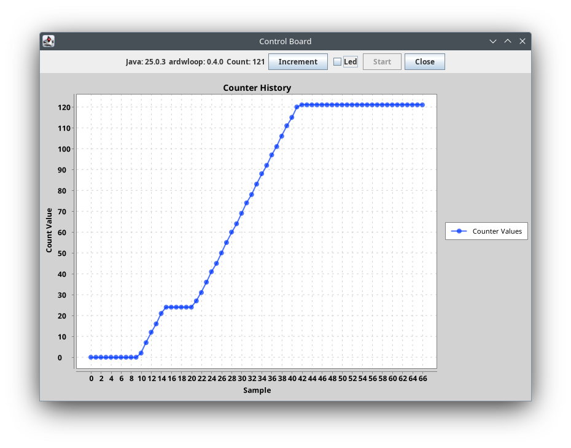

# control-board



This project is a control board application that demonstrates the integration between a Java/Kotlin desktop application and an Arduino-based board. It uses the [ardwloop](https://github.com/llschall/ardwloop) library to establish a communication loop between the two environments.


## Getting Started

To clone the repository and run the application:

```bash
git clone https://github.com/llschall/control-board.git
cd control-board
./gradlew bootRun
```

## Structure

The project is built using the **Spring Boot** framework, which handles dependency injection and service management. The user interface is implemented using Swing and follows the **MVVM (Model-View-ViewModel)** pattern:

- **Model**: `CounterModel.kt` (Kotlin) - Manages the state and business logic of the counter.
- **ViewModel**: `CounterViewModel.java` - Exposes data and commands from the Model to the View, abstracting the business logic.
- **View**: `AppWindow.java` - The graphical user interface that observes changes and triggers actions via the ViewModel.

## Features

- **Control**:
  - The built-in LED of the Arduino board turns depending on the checkbox of the Java application.
  - The value sent by Arduino only increments if the LED is on. 
  - The value sent by Arduino is rendered on the Java application chart.
- **Synchronization**: Real-time counter updates between Arduino and Java.
- **Visualization**: Live history chart refreshing every second.

## Components

- **Java/Kotlin**: Main application logic under `src/main`.
- **Arduino**: Located in `ino/control-board/control-board.ino`.
